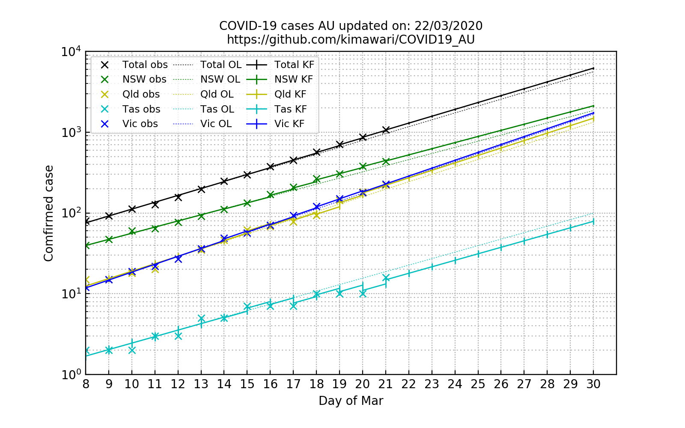

# COVID19_AU
A simple linear regreesion model to predict Australian corona virus cases in early logarithmic growth. Update daily using Kalman filter data assimialtion technique.  
一个简单的线性回归模型预测澳洲初期新冠感染数。使用卡尔曼滤波方法融合每日更新数据以更新模型。  
Lattest update:  
最新:  
  
Linear regression model were trained using data during Mar 8-15. KF updating started from Mar 14.  
3月8日-15日的数据用于拟合线性模型。卡尔曼滤波从3月14日开始更新模型。  
Legend:  
图例:   
    Continuous line: the estimated number with KF data assimilation.  
    实线：使用使用线性模型与卡尔曼滤波更新的预测。  
    Dotted line: the estimated number without KF data assimiltion (called "open-loop").  
    虚线：使用线性模型但不使用卡尔曼滤波的预测。  
    Cross: the real reported number (observation).  
    叉：实际报道（观测）数。  
    
