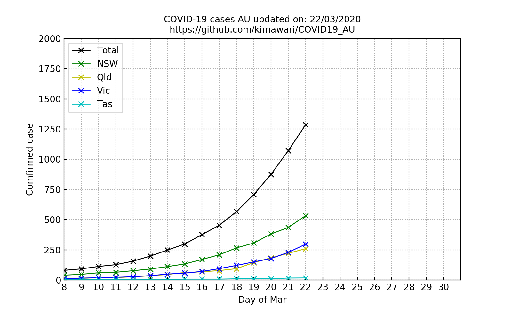

# COVID19_AU
A simple linear regreesion model to predict the early growth of Australian corona virus cases. Update daily using Kalman filter (KF) data assimialtion technique.  
一个简单的线性回归模型预测澳洲初期新冠感染数。使用卡尔曼滤波方法融合每日更新数据以更新模型。  
Latest update on 22/3/2012:  
最近更新于2020年3月22日：  
Raw data display a exponential growth:  
原始数据为指数增长：  
  

Data shows a linear growth under logarithmic scale. The model prediction and updating is below:  
数据在对数坐标下为直线增长。模型预测与更新如下图:  
  
Linear regression model were trained using data during Mar 8-15. KF updating started from Mar 14.  
3月8日-15日的数据用于拟合线性模型。卡尔曼滤波从3月14日开始更新模型。  
Legend:  
图例:   
    Continuous line: KF, the estimated number with KF data assimilation.  
    实线：使用使用线性模型与卡尔曼滤波更新的预测。  
    Dotted line: OL, the estimated number without KF data assimiltion (called "open-loop").  
    虚线：使用线性模型但不使用卡尔曼滤波的预测。  
    Cross: observation, the real reported number.  
    叉：实际报道（观测）数。  
    
